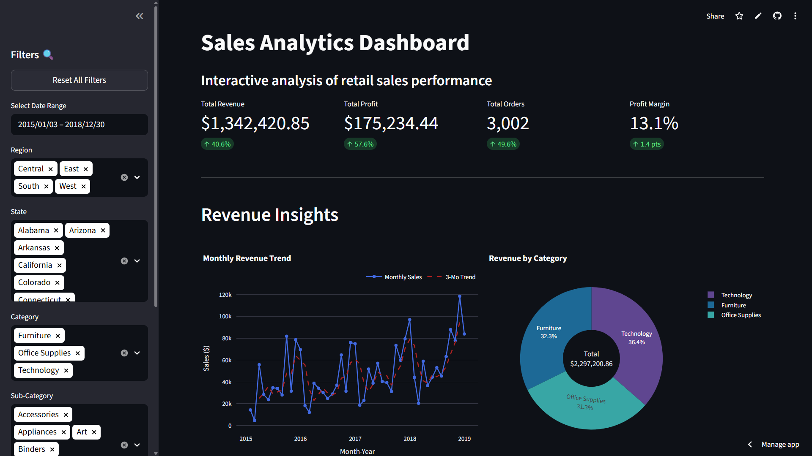
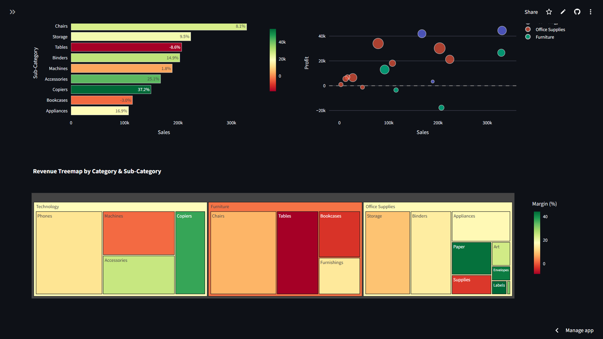

# Sales Analytics Dashboard

## Overview

An interactive Streamlit dashboard for retail sales analysis with real-time filtering, KPI tracking, trend analysis, and profitability insights. Built using the classic Superstore Sales dataset, this tool provides enterprise-grade business intelligence at your fingertips.

## Live Demo

[🔗 View Live Dashboard on Streamlit Cloud](https://streamlit.io/cloud) _(Placeholder)_

## Screenshots and Videos

|                  Dashboard Overview                   |
| :---------------------------------------------------: |
|  |

|            Profitability Analysis Section             |
| :---------------------------------------------------: |
|  |

|                    Demo Video                     |
| :-----------------------------------------------: |
|  |

## Features

- **Real-time filtering** by date range, region, state, category, and customer segment.
- **Hierarchical selection** logic (e.g., States update based on selected Regions).
- **KPI cards** with automated period-over-period growth comparisons.
- **Revenue trend analysis** featuring 3-month moving averages.
- **Product profitability matrix** and interactive **Treemaps**.
- **Customer segment analysis** with dual-axis performance charts.
- **Exportable data explorer** allowing CSV downloads of filtered datasets.
- **Responsive layout** optimized for wide screens.

## Tech Stack

- **Dashboard Framework**: [Streamlit](https://streamlit.io/)
- **Data Visualization**: [Plotly](https://plotly.com/python/)
- **Data Manipulation**: [Pandas](https://pandas.pydata.org/), [NumPy](https://numpy.org/)
- **Dataset**: Superstore Sales Dataset

## How to Run

1. **Clone the repository**:

   ```bash
   git clone https://github.com/your-repo/sales-dashboard.git
   cd sales-dashboard
   ```

2. **Install dependencies**:

   ```bash
   pip install -r requirements.txt
   ```

3. **Launch the app**:
   ```bash
   streamlit run app.py
   ```

---

Dashboard built with Streamlit & Plotly | Data: Sample Retail Dataset | Author: Antigravity AI
